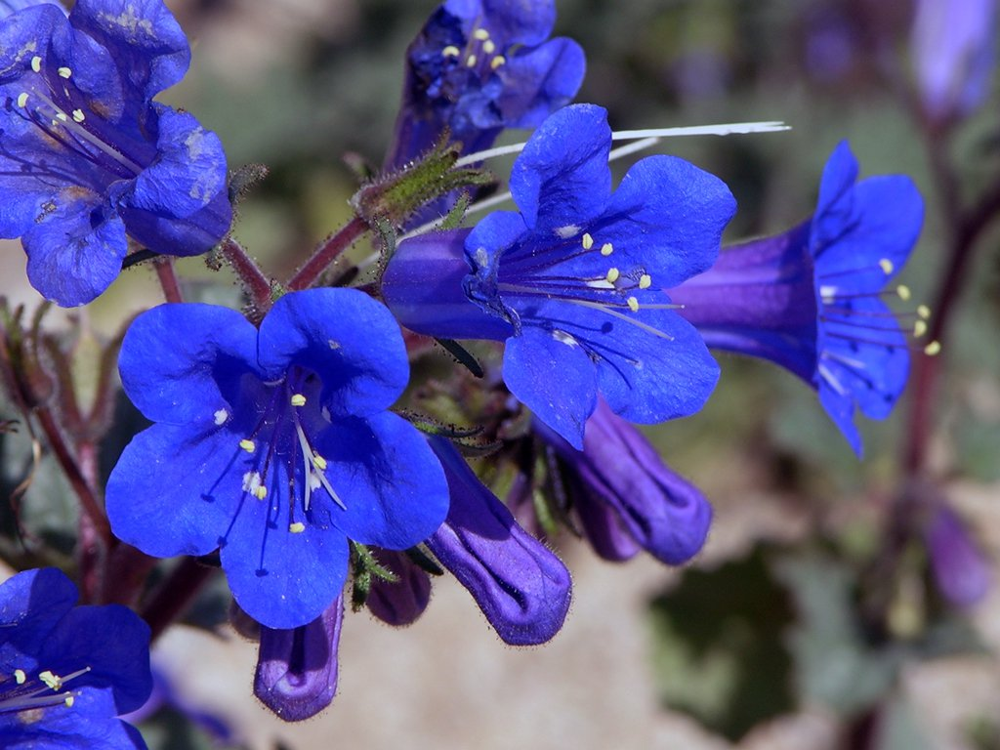
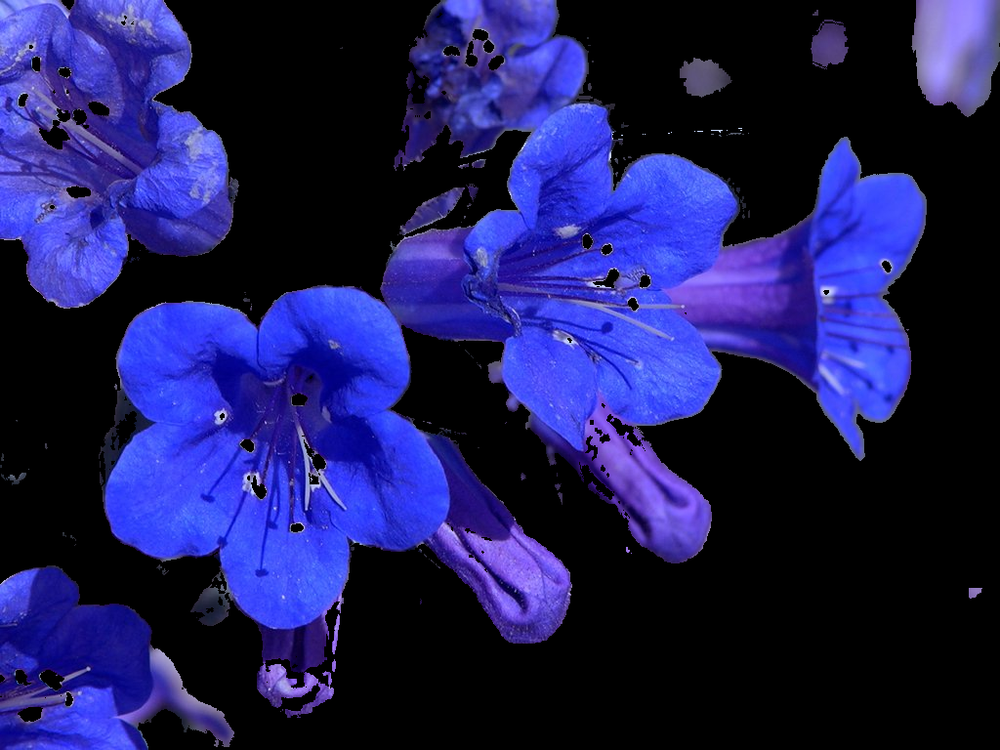
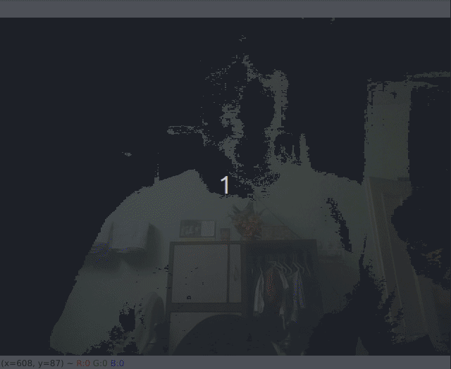

# Invisibility Cloak 

This is a project for the *Introduction to Python* event by the **FreeScape IIIT Kalyani** club.

This is a very popular project, and I will be following some articles and/or github links, all of which we will provided as references for the reader to peruse.

We will be using OpenCV for this project. 

The idea behind the work is that we first capture the background image. Then we detect and segment the cloth(it is important that a **red** cloth is used, as the code has been written for that specific colour).


## Detection and segmenation

First we need to detect the color we want inside the image/frame and create a mask for colors in a range. This will help us to segment out every object inside the image/frame whose color belong in that range.

This is achieved by the following piece of code:

```python
#converting BGR image to HSV
hsv = cv2.cvtColor(img, cv2.COLOR_BGR2HSV)
#lower limit of the range
low_blue = np.array([110, 50, 50])
#upper limit of the range
high_blue = np.array([130, 255, 255])
#creating the mask
mask = cv2.inRange(hsv, low_blue, high_blue)
#applying the mask
res = cv2.bitwise_and(img, img, mask=mask)
```
The variable `res` is the final image/frame with the color segmented out

Normal Image | Blue segmented
:----------------------:|:----------------:
 | 

The code is available [here](utility-funcs/segment_color.py)


## Showing background

Now we have a foor loop for 100 iterations in the beginning of the code to capture the background without the human inside it. After segmenting the color from the image, we will display the background through the color segmented part in the frame. 
For example, the code [here](utility-funcs/color_seg.py) segments yellow color from the frame, this segmented mask is used for showing the background through this mask [here](utility-funcs/backg_seg.py). 

As I was wearing a yellow T-shirt, the background could be seen through my shirt.




